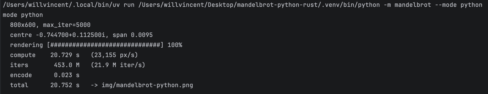
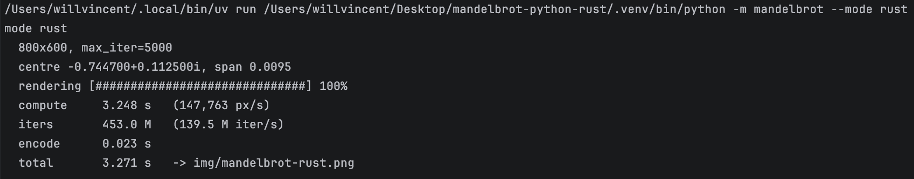

# mandelbrot-python-rust

A command line tool rendering images of the [Mandelbrot set](https://en.wikipedia.org/wiki/Mandelbrot_set) in pure Python and with core function, `escape_count`, rewritten in Rust with [PyO3](https://pyo3.rs) and [maturin](https://www.maturin.rs). `src/lib.rs` is deliberately tiny — one `#[pyfunction]` and nothing else.


## The numbers

Same viewport, same **453 million iterations** of `z = z² + c`, same everything
— except which `escape_count` gets called. Run on an Apple M4 Max.

| mode | `escape_count` |    time | throughput | speedup |
| --- | --- |--------:| ---: |--------:|
| `python` | pure Python | 20.73 s | 22 M iter/s |      1× |
| `rust` | Rust |  3.25 s | 420 M iter/s |  **6×** |

**Pure Python**



**Rust**



## Setup

Requires Python 3.10+, a Rust toolchain via [rustup](https://rustup.rs),
[uv](https://docs.astral.sh/uv/), and [just](https://github.com/casey/just) for
the shortcut below.

```sh
just develop                # or: uv run maturin develop --release
```

`develop` compiles `src/lib.rs` and installs it into `.venv` as
`mandelbrot._fast`.
